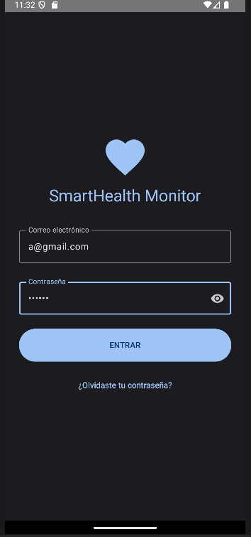
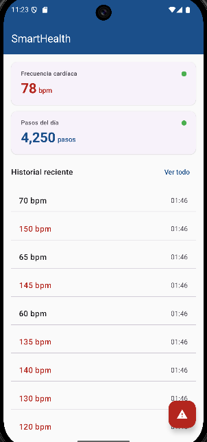
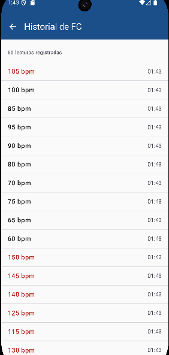
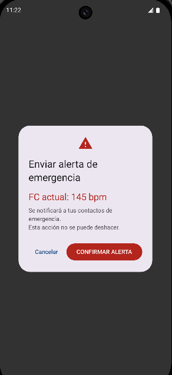
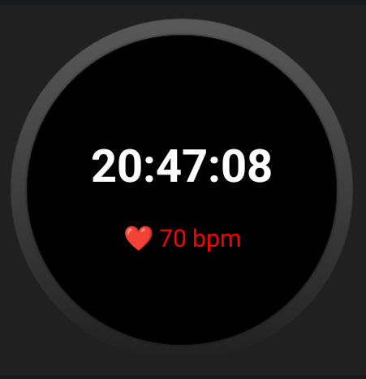
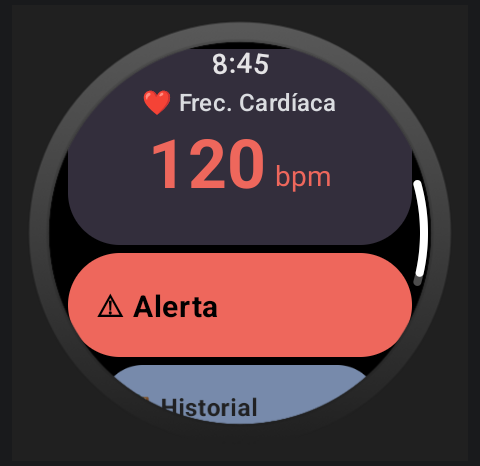

# SmartHealthMonitor

Aplicación Android de monitoreo de salud personal en tiempo real.
Desarrollada como proyecto integrador -UNTG 9no Cuatrimestre 2026.
##Stack Tecnológico.

| Tecnología                   | Uso                                    |
|------------------------------|----------------------------------------|
| Kotlin + Jetpack Compose     | UI declarativa con Material Design 3   |
| Wearable + Data Layer API    | Comunicación Reloj a teléfono (BLE)    |
| Health Service API           | Sensor FC real en background (wear OS) |
| Room Database                | Historial persistente de lecturas FC   | 
| Jetpack Navigation           | NavHost entre 4 pantallas              |
| Github + Convential Commits | Control de versiones profesional       |

# Pantallas
|Pantallas|Descripción|
|---|---|
|LoginScreen|Autentificación con validación y State|
|DashboardScreen|FC y Pasos en tiempo real del wearable|
|HistorialScreen| Lecturas persistidas en Room con Flow Reactivo|
|AlertaScreen|AlertDialog MD3 + Snackbar de confirmación|

# Unidad II - Wear OS
| Pantallas           | Descripción                                         |
|---------------------|-----------------------------------------------------|
| WearDashboardScreen | FC en tiempo real con ScalingLazyColumn y Time Text |
| WearHistorialScreen | Lista con Rotary Input(corona del reloj)            |
| WearAlertaScreen    | Botones Circulares de confirmación                  |
| WearHistorialScreen | Hora + FC en el WatchFree nativo                    |

## Capturas de pantallas.

## Autor
Leonel Alejandro Torres Pérez - UTNG - leyotorres1501@gmail.com
